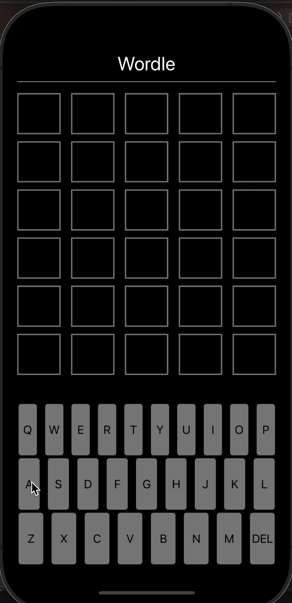

# Project 1 - *Wordle Remake*

Submitted by: **Anthony Campos**

**Wordle Remake** is an app that emulates the popular Wordle game. 

Time spent: **7** hours spent in total

## Required Features

The following **required** functionality is completed:

- [X] App displays a keyboard on the screen
- [X] When tapping on the keyboard, a letter is shown or deleted (letter selected)
- [X] User can play a basic version of Wordle, with different goal words each time

The following **optional** features are implemented:

- [ ] Improve and customize the user interface by adding a launchscreen and app icon
- [ ] Run the app on a device rather than in the simulator

The following **additional** features are implemented:

- [ ] List anything else that you can get done to improve the app functionality!

## Video Walkthrough

GIF created with https://getkap.co/

## Notes

Since I am learning the Swift programming language, I spent a good amount of time reading the documentation. 

## License

    Copyright [yyyy] [name of copyright owner]

    Licensed under the Apache License, Version 2.0 (the "License");
    you may not use this file except in compliance with the License.
    You may obtain a copy of the License at

        http://www.apache.org/licenses/LICENSE-2.0

    Unless required by applicable law or agreed to in writing, software
    distributed under the License is distributed on an "AS IS" BASIS,
    WITHOUT WARRANTIES OR CONDITIONS OF ANY KIND, either express or implied.
    See the License for the specific language governing permissions and
    limitations under the License.
